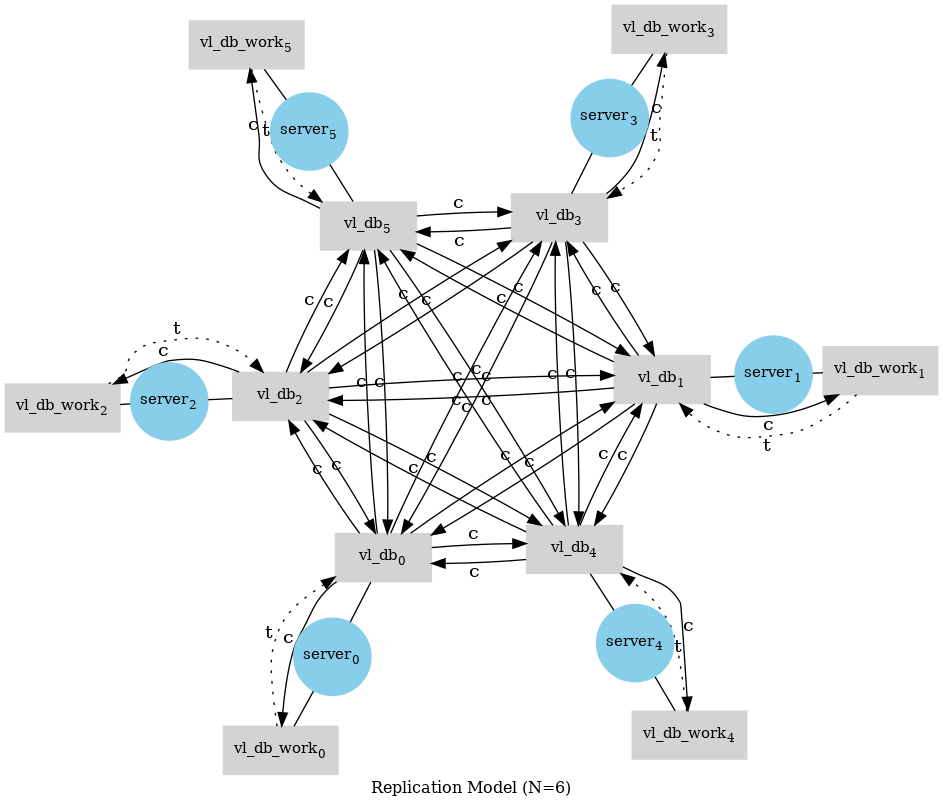

# RepliClj



Keep CouchDB (v3) replications alive, generate database users, visualize replication status.

## Replication documentation

* [introduction to replication](https://docs.couchdb.org/en/stable/replication/intro.html#introduction-to-replication) 
* `RepliClj` uses [persistent replication](https://docs.couchdb.org/en/stable/replication/intro.html#transient-and-persistent-replication)
* [replication start, stop](https://docs.couchdb.org/en/stable/replication/intro.html#transient-and-persistent-replication)
* [replication states descriptions](https://docs.couchdb.org/en/main/replication/replicator.html#states-descriptions]

## Environment vars

Most operations need admin rights e.g. the generation of the `_users`,
`_replicator` etc. datebases and the generation and adding the
`cal` user. The following environment variables should be set:

* `export ADMIN_USR=<admins name>` (defaults to "admin")
* `export ADMIN_SECRET=<admins secret>` **this is not the password**
* `export CAL_USR=< users name>` (defaults to "cal")
* `export CAL_PWD=< users password>`

## generate uberjar (tools.deps)

`tools.deps` version with [depstar](https://github.com/seancorfield/depstar):

```shell
clojure -X:uberjar :aot true :jar repliclj.jar :main-class repliclj.server :aliases '[:dev]'
```

```shell
java -jar repliclj.jar
```

## systemd

```shell
cd /path/to/repliclj
sudo mkdir /usr/local/share/
sudo cp repliclj.jar /usr/local/share/repliclj
sudo cp repliclj.service  /etc/systemd/system/
sudo systemctl enable repliclj.service
sudo systemctl start repliclj.service
sudo systemctl status repliclj.service
``` 

## notes

### model graph

```shell
neato model.dot -T png > model.png
```
